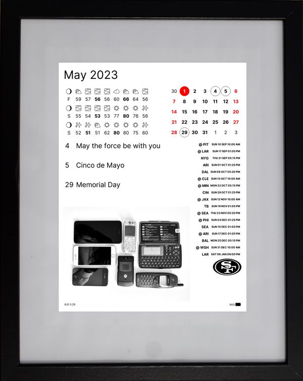
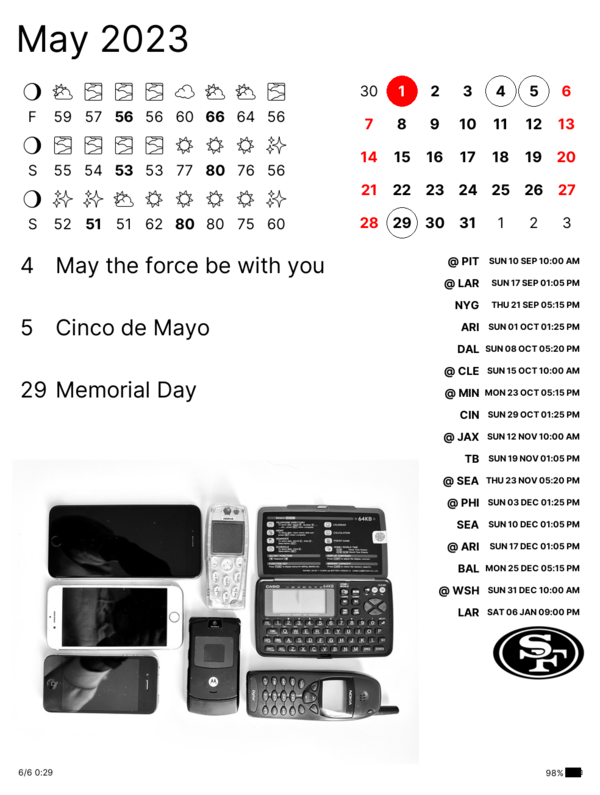
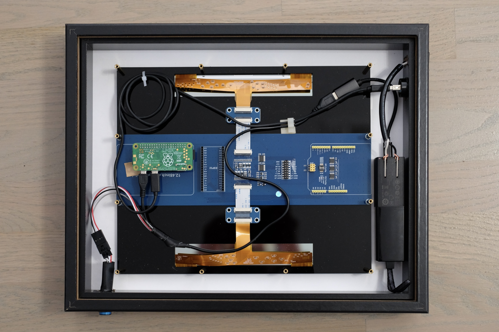
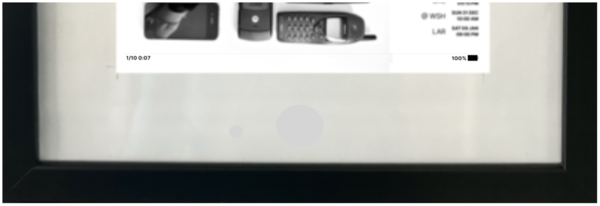
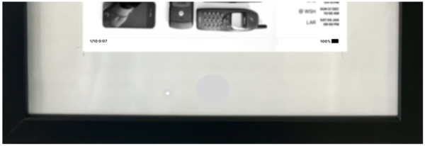
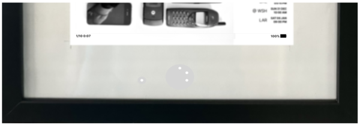

# ePiCal

ePaper Pi Calendar - An [ePaper](https://www.waveshare.com/12.48inch-e-paper-module-b.htm) calendar project using [Raspberry Pi Zero W](https://www.raspberrypi.com/products/raspberry-pi-zero/)

| [](./docs/display.png) | [](./docs/epical.png) |
|-----------------------------------------------------------|---------------------------------------------------------|

## Hardware


| Item                                                                                          |    USD |
|-----------------------------------------------------------------------------------------------|-------:|
| [12.48 Inch ePaper Display](https://www.waveshare.com/12.48inch-e-paper-module-b.htm)         | 180.00 |
| [Pi Zero W](https://www.raspberrypi.com/products/raspberry-pi-zero/) *                        |   6.00 |
| [Micro SD Card](https://www.amazon.com/SanDisk-Ultra-microSDXC-Memory-Adapter/dp/B073JWXGNT/) |  10.00 |
| [5000 mAh Power Bank with LED indicator](https://a.co/d/1OBHnF4)                              |  29.00 |
| [Latching On/Off Push Button Switch](https://www.adafruit.com/product/1476)                   |   2.00 |
| [330 Ohm Resistor](https://www.sparkfun.com/products/14490)                                   |   1.00 |
| [4 Pin JST Connector](https://www.sparkfun.com/products/14576)                                |   2.00 |
| [USB 3.0 Panel Mount Metal Connector](https://a.co/d/0kZ72eU)                                 |  12.00 |
| [C8 Panel Mount AC Plug Adapter](https://a.co/d/36p8TcL)                                      |   9.00 |
| [C7 AC Power Cord](https://a.co/d/dZaa9nc)                                                    |   7.00 |
| [USB-C to USB Adapter with LED indicator](https://a.co/d/1nhhcsH)                             |   8.00 |
| [Micro USB Cables](https://a.co/d/dhG1ZI5)                                                    |   5.00 |
| [11x14 Inch Shadow Box Frame](https://a.co/d/8zbSuwI)                                         |  18.00 |

_* Availability and pricing keeps changing_ 

[](./docs/gallery/gallery.md)

_*More images in [gallery](./docs/gallery/gallery.md)*_

- Pi Zero connects through the header pins available on the screen module.
- A push button switch is added to the + red wire of the USB cable between power bank and Pi Zero PWR usb port for [manual daily refresh](./docs/power.md).
  - Wire the push button indicator LED to + red and - black USB cable wires,  with a resistor on the + lead
  - A male female JST connector is used for quick disconnect of button wires
- The second Pi Zero USB port is connected to USB panel mount connector outside the frame
  - Use this USB connector port for always on power with an external USB cable
  - Also used to connect to Pi Zero for diagnostics if Wi-Fi is not available
- The power bank AC Power prongs are connected to a C8 AC plug adapter outside the frame
  - Quick charging of Power bank by connecting C7 AC power cord when needed
- Estimated [battery usage](./docs/battery.md) % based on device uptime is displayed at the bottom right of the screen.
- The [power](./docs/power.md) bank battery indicator LEDs are positioned to shine through the white paper border of the frame.
 - When device is off battery power LED turns off and the [power](./docs/power.md) can be turned off safely using the push button

|  |  |
|:----------------------------:|:-------------------------------:|
|         Disconnected         |     Standby (Connector LED)     |
|   |   |
|      On (Battery LEDs)       |        On (Battery LEDs)        |

## Software

| Module                       | Details                      |
|------------------------------|------------------------------|
| [epical](./epical/README.md) | The calendar layout          |
| [grid](./grid/README.md)     | A simple grid layout engine  |
| [epd](./epd/README.md)       | The Waveshare display driver |
| [web](./web/README.md)       | Optional control server      |

## Deploy

- Set up [display driver](./epd/README.md)
- Create a python venv and install required python packages using `make`

```shell
$ make deps
```

## Configure

- Update options in [epical/config.py](./epical/config.py)
- Update events in [epical/resources/events.json](./epical/resources/events.json)
- Add daily rotation photos in [epical/resources/photos](./epical/resources/photos)
- Add event day photos in [epical/resources/event_photos](./epical/resources/event_photos)

> See more [configuration file details](./docs/config.md) and [photo formatting and selection details](./docs/photos.md)

## Run

**Run using `make`**

```shell
$ make run
```

**Or run directly**

```shell
$ mkdir -p ~/.epical
$ python3 -m venv venv
$ source venv/bin/activate
$ pip install -r requirements.txt
$ cd epical
$ python3 main.py
```

**Or schedule the run using cron**

- When connected to external power, update daily using cron - modify example [run.sh](./run.sh)
- When using a battery pack or power bank, update on boot and shutdown  - modify example [run_and_halt.sh](./run_and_halt.sh) and [check_run_and_halt.sh](./check_run_and_halt.sh)

> More details in [power management](./docs/power.md) and [battery tracking](./docs/battery.md)

### Run on Pi Zero device

```shell
hackorama@pizero:~/epical $ source venv/bin/activate
(venv) hackorama@pizero:~/epical $ cd epical
(venv) hackorama@pizero:~/epical/epical $ python main.py
INFO     2023-07-01 18:06:56,467 - ePiCal 0.1.0
INFO     2023-07-01 18:06:56,471 - Data fetch 1/3
INFO     2023-07-01 18:07:03,159 - Displaying resources/photos/photo.jpeg
INFO     2023-07-01 18:07:03,632 - Battery up days   8
INFO     2023-07-01 18:07:03,635 - Device boot count 5
INFO     2023-07-01 18:07:03,643 - Device up time    3:29
INFO     2023-07-01 18:07:03,646 - Display up time   0:10
INFO     2023-07-01 18:07:03,649 - Battery           85%
INFO     2023-07-01 18:07:03,671 - Initializing screen ...
EPD init...
set wiringPi lib success !!!
INFO     2023-07-01 18:07:06,731 - Preparing mono images ...
INFO     2023-07-01 18:08:48,492 - Updating screen ...
471.712018404
use time: 95.652717
INFO     2023-07-01 18:10:55,430 - Powering down screen ...
module_exit
INFO     2023-07-01 18:10:55,570 - Finished screen
INFO     2023-07-01 18:10:55,665 - Uploaded epical.log
INFO     2023-07-01 18:10:55,779 - Uploaded epical.png

```

### Run on local dev system 

```shell
~/hackorama/epical $ source venv/bin/activate
~/hackorama/epical $ cd epcial
~/hackorama/epical/epcial $ python3 main.py
INFO     2023-07-01 18:25:07,314 - ePiCal 0.1.0
INFO     2023-07-01 18:25:07,314 - Data fetch 1/3
INFO     2023-07-01 18:25:08,870 - Found override photo resources/photos/photo.jpeg
INFO     2023-07-01 18:25:08,870 - Displaying resources/photos/photo.jpeg
WARNING  2023-07-01 18:25:09,078 - Please update battery charge time by running: date > ~/.epical/battery
WARNING  2023-07-01 18:25:09,079 - No 'uprecords' tool installed and no data file provided as ~/.epical/uprecords.txt
WARNING  2023-07-01 18:25:09,079 -   Please configure 'uptimed' and 'uprecords' following docs/battery.md
INFO     2023-07-01 18:25:09,082 - Initializing screen ...
WARNING  2023-07-01 18:25:09,086 - EPD lib import failed: No module named 'RPi'
WARNING  2023-07-01 18:25:09,086 -   Please install EPD lib in ../epd/lib following epd/README.md
WARNING  2023-07-01 18:25:09,086 -   Will run using virtual display
INFO     2023-07-01 18:25:09,086 - Using virtual display ...
INFO     2023-07-01 18:25:09,086 - Preparing mono images ...
INFO     2023-07-01 18:25:10,575 - open epical.png
INFO     2023-07-01 18:25:10,575 - open epical_black.png
INFO     2023-07-01 18:25:10,576 - open epical_red.png
```

## Documentation

See [list of developer and user documents](./docs/index.md)

## Development

```shell
$ make help
help:            Show help
deps:            Install required python packages
dev_deps:        Install required dev python packages
check:           Run python code checks
tests:           Run tests
run:             Run display test
```
## Pending Features

- Support [iCal](https://en.wikipedia.org/wiki/ICalendar) and import calendar events from web mail accounts
- [Using a UPS add on board](./docs/ups.md) that supports scheduled wake and screen refresh
- [Connecting a power status LED](./docs/led.md) instead of using the power bank LED
