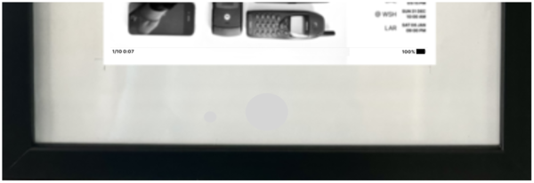
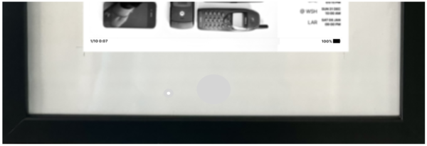
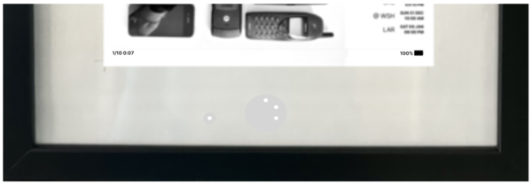

# Power Management

You can either run the device connecting to a USB power adapter or powered using a 
battery pack or power bank.

> Or as a third option [use a UPS add on board](./ups.md) that supports scheduled wake and screen refresh


## Always on with power supply with auto refresh

Connect to any commonn [15W 5.1V/3.0A DC USB Power Adapter](https://www.pishop.us/product/raspberry-pi-15w-power-supply-us-white/?src=raspberrypi)

Add once a day cron job to refresh the screen 

```commandline
$ cronatab -l
SHELL=/bin/bash
0 1 * * * /home/hackorama/epical/run.sh > /home/hackorama/.epical/epical.log 2>&1  &
```

## Use battery with manual refresh

Connect to any [5V Power Bank](https://a.co/d/1OBHnF4) with enough capacity that fits into the frame with an on/off button.

Add a cron job that refresh display on boot and halts the device.

```commandline
$ cronatab -l
SHELL=/bin/bash
@reboot sleep 60 && /home/hackorama/epical/run_and_halt.sh > /home/hackorama/.epical/epical.log 2>&1  &
```

Press the button to refresh as needed.

## Power status tracking

You can display the estimated the battery usage for device up-time on the screen bottom status line by [configuring battery charge time](./battery.md).

|  |  |
|:-----------------------:|:--------------------------:|
|      Disconnected       |  Standby (Connector LED)   |
|   |   |
|    On (Battery LEDs)    |     On (Battery LEDs)      |


Depending on the power bank model used like [this 5000 mAh Power Bank with LED indicator](https://a.co/d/1OBHnF4)
the charge indicator LEDs can be positioned to shine through the frame paper border.
And using a [USB-C to USB Adapter with LED indicator](https://a.co/d/1nhhcsH) can show the standby power status.
