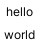
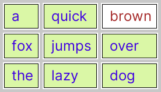
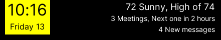
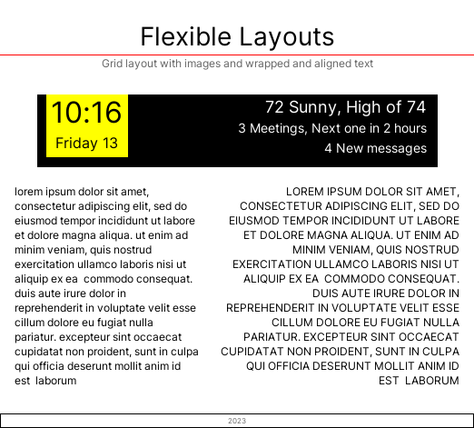
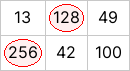
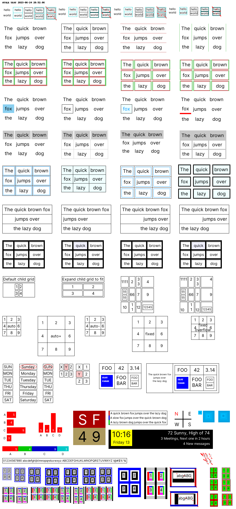

# Grid

A simple grid layout engine for [Pillow/PIL](https://pillow.readthedocs.io/) imaging library.

Useful for creating quick dynamic screen data layouts for ePaper/eInk display projects using Raspberry Pi or other SBC boards.

Used for creating [ePiCal](../README.md) layout.

[](../docs/epical.png)

## Features

- Grid content is provided as a two-dimensional array
- Grid content can be a mix of
  - Text (strings, numbers)
  - Image
  - Another Grid
- Supports common styles
  - Grid and cell borders
  - Grid and cell margins
  - Text color and bg color
  - Content alignment
- The grid will be sized based on content sizes adaptively
- Grid can contain other grids that will be recursively rendered

## Not supported

- Text wrapping of cell content 
  - Work around by providing text already wrapped with end of lines using [textwrap](https://docs.python.org/3/library/textwrap.html)
- No row/column specific size support
  - The row and columns are automatically sized based on the content sizes
  - But you can achieve specific row/column size using grid size and cell margins
- Variable row/column cell sizes are not supported

## Usage example

> Full API documentation and PyPi packaging coming soon.

See [example.py](./example.py) for usage.

## Simple example

```python
from grid import Grid

grid = Grid([["hello"], 
             ["world"]])

image = grid.image()

image.save("hello.png", "PNG")
```



## Styling example

```python
from grid import Grid

grid = Grid([["a", "quick", "brown"], 
             ["fox", "jumps", "over"], 
             ["the", "lazy", "dog"]])

grid.style().set_grid_border(5, (200, 200, 200))
grid.style().set_cell_border(1, 1, 1, 1)
grid.style().set_bg_color((218, 247, 166))
grid.style().set_font_size(24).set_font_color((63, 0, 225))
grid.style().set_margin(10, 10, 5, 5).set_align(left=True)
grid.style(0, 2).set_font_color((165, 42, 42)).set_bg_color((255, 255, 255))

image = grid.image()

image.save("style.png", "PNG")
```



## Complex layout with container grid

```python
from grid import Grid

time_grid = Grid([["10:16"], ["Friday 13"]])

time_grid.style().set_bg_color((255, 255, 0))
time_grid.style().set_margin(5, 5, 0, 5)
time_grid.style().set_outer_margin(0, 0, 0, 0)
time_grid.style().set_align(top=True)
time_grid.style(0, 0).set_font_size(32)
time_grid.style(1, 0).set_font_size(16)

messages_grid = Grid(
    [
        ["72 Sunny, High of 74"],
        ["3 Meetings, Next one in 2 hours"],
        ["4 New messages"],
    ]
)

messages_grid.style().set_bg_color((0, 0, 0))
messages_grid.style().set_font_color((255, 255, 255))
messages_grid.style().set_margin(100, 0, 0, 0)
messages_grid.style().set_align(right=True)
messages_grid.style().set_font_size(14)
messages_grid.style(0, 0).set_font_size(18)

main_grid = Grid([[time_grid, messages_grid]])

main_grid.style().set_bg_color((0, 0, 0))
main_grid.style().set_margin(10, 10, 0, 10)
main_grid.style().set_outer_margin(0, 0, 0, 0)
main_grid.style().set_align(top=True)

complex_image = main_grid.image()

complex_image.save("complex.png", "PNG")
```




## Another layout example

Using a long text passage and the image from last example.

```python
wrapped_text = "\n".join(textwrap.wrap(text_passage, width=37))

text_grid = Grid([[wrapped_text.lower(), wrapped_text.upper()]])
text_grid.style().set_margin(10)
text_grid.style(0, 0).set_align(left=True)
text_grid.style(0, 1).set_align(right=True)

grid = Grid(
    [
        ["Flexible Layouts"],
        ["Grid layout with images and wrapped and aligned text"],
        [complex_image],
        [text_grid],
        ["2023"],
    ]
)

grid.style(0, 0).set_font_size(28)
grid.style(1, 0).set_font_size(12).set_font_color((100, 100, 100))
grid.style(0, 0).set_outer_margin(top=20)
grid.style(1, 0).set_outer_margin(bottom=20)
grid.style(0, 0).set_cell_border(bottom=1, bottom_color=(255, 0, 0))
grid.style(4, 0).set_outer_margin(0, 0, 0, 0)
grid.style(4, 0).set_font_size(8).set_font_color((100, 100, 100))
grid.style(4, 0).set_cell_border(1, 1, 1, 1, (0, 0, 0), (0, 0, 0), (0, 0, 0))

image = grid.image()

image.save("layout.png", "PNG")
```



## Custom style example

Customize rendering beyond standard styles using any custom PIL/Pillow drawing methods.

```python
from grid import Grid

class MyGrid(Grid):
    def _draw_cell(
        self,
        row: int = 0,
        col: int = 0,
        x1: int = 1,
        y1: int = 1,
        x2: int = 1,
        y2: int = 1,
        debug: bool = False,
    ) -> None:
        if self._data[row][col] > 100:
            draw = self._get_draw()
            draw.ellipse(
                (x1 + 4, y1 + 4, x2 - 4, y2 - 4),
                fill=(255, 240, 240),
                outline=(255, 0, 0),
            )
        super()._draw_cell(row, col, x1, y1, x2, y2, debug)


grid = MyGrid([[13, 128, 49], [256, 42, 100]])

grid.style().set_margin(5, 5, 5, 5).set_font_size(16)
grid.style().set_grid_border(1, (200, 200, 200))
image = grid.image()

image.save("custom.png", "PNG")
```



## More examples

Please see the [./tests/test_style.py](./tests/test_style.py) for more examples of usage.



## Develop

```shell
$ make help
help:            Show help
deps:            Install required python packages
dev_deps:        Install required dev python packages
check:           Run python code checks
tests:           Run tests
```