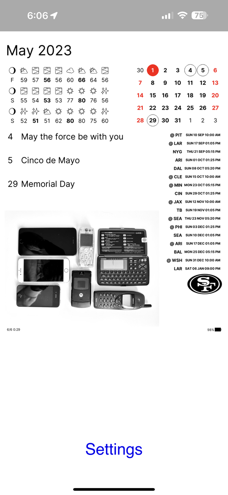
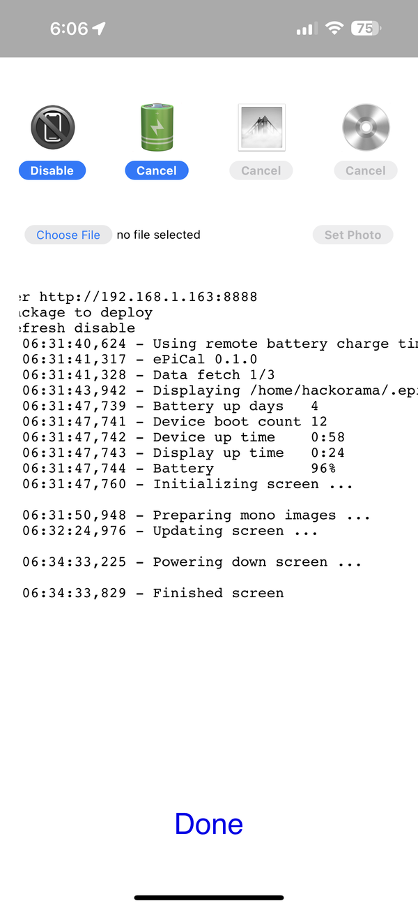

# ePiCal Web Helper

An optional supplementary web server for ePiCal
for running either on the Pi Zero device or outside on a server.

- When device is connected to power and always on
  - Run the server on the device
  - Use it for triggering on-demand screen refresh
  - Extend for other controls like: photo upload, configuration changes etc.
- When device is on battery with scheduled wake up and run
  - Run it outside the device on a home server
  - So the screen image and logs can be uploaded from the device
  - Server can then show the screen from the device as a web app
  - Server can show the device logs for debugging
  - Device run script can check the server for run controls
    - Check and disable display refresh, override photo, deploy new release etc.
    - Example: [check_run_and_halt.sh](../check_run_and_halt.sh) and [control protocol](./server/static/README.md)

Use the web server to check the screen image, logs and control check settings from the phone on the home network

|  |  |
|-------------------------------------|---------------------------------------------|

## Deploy

Deploy the server on the external server

Either run `make deps` to install dependencies in a venv or manually setup as follows:

```bash
$ cd web
$ python3 -m venv venv
$ source venv/bin/activate
$ pip instal -r requirements.txt
$ cd server
```

## Run

Start the server on the external server

```bash
$ cd server
$ ./server.sh
Server starting ...
Server started 90619 ...
$ cat run.pid
90619
$ tail -f static/server.log
...
INFO:     Uvicorn running on http://0.0.0.0:8888 (Press CTRL+C to quit)
```

## Enable data upload from device

Enable data upload in [config.py](../epical/config.py)

```python
UPLOAD_ENABLED: bool = True
UPLOAD_LOGS_URL: str = "http://home.local.net:8888/upload/logs"
UPLOAD_SCREEN_URL: str = "http://home.local.net:8888/upload/screen"
```

## Control checks from  device

Please see [control protocol](./server/static/README.md)

